## Part 1. Установка ОС

**== Задание ==**

##### Установить **Ubuntu 20.04 Server LTS** без графического интерфейса. (Используем программу для виртуализации - VirtualBox)

- Графический интерфейс должен отсутствовать.

- Узнайте версию Ubuntu, выполнив команду \
`cat /etc/issue.`
- Вставьте скриншот с выводом команды.
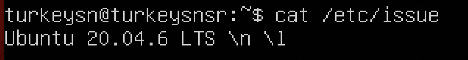
## Part 2. Создание пользователя

**== Задание ==**

##### Создать пользователя, отличного от пользователя, который создавался при установке. Пользователь должен быть добавлен в группу `adm`.

- Вставьте скриншот вызова команды для создания пользователя.
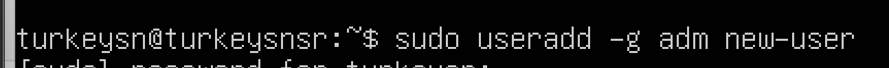
- Новый пользователь должен быть в выводе команды \
`cat /etc/passwd`
- Вставьте скриншот с выводом команды.
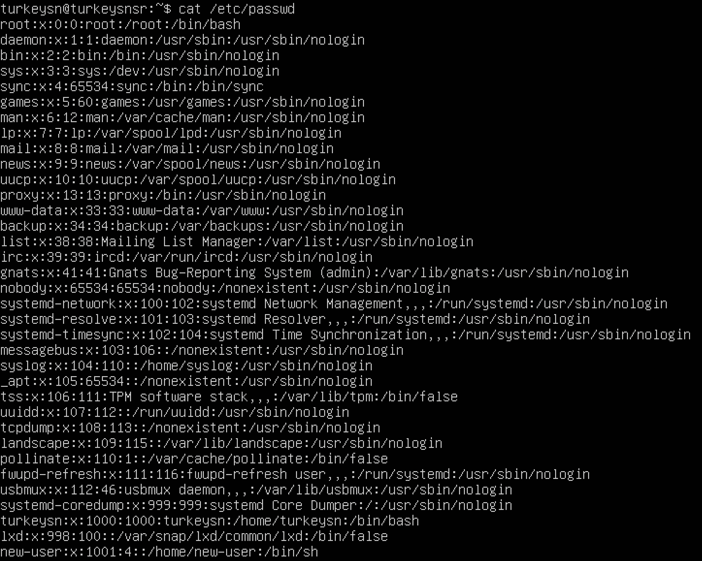
## Part 3. Настройка сети ОС

**== Задание ==**

##### Задать название машины вида user-1  
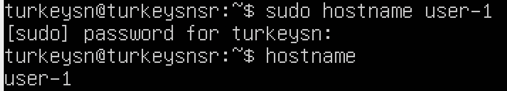
##### Установить временную зону, соответствующую вашему текущему местоположению.  

##### Вывести названия сетевых интерфейсов с помощью консольной команды.
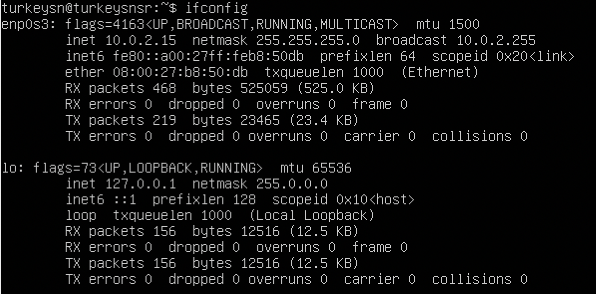
- В отчёте дать объяснение наличию интерфейса lo.  

``lo (loopback device) – виртуальный интерфейс, присутствующий по умолчанию в любом Linux. Он используется для отладки сетевых программ и запуска серверных приложений на локальной машине. С этим интерфейсом всегда связан адрес 127.0.0.1. У него есть dns-имя – localhost.`` 

##### Используя консольную команду получить ip адрес устройства, на котором вы работаете, от DHCP сервера. 

- В отчёте дать расшифровку DHCP.  

``DHCP (англ. Dynamic Host Configuration Protocol — протокол динамической настройки узла) — сетевой протокол, позволяющий сетевым устройствам автоматически получать IP-адрес и другие параметры, необходимые для работы в сети TCP/IP. Данный протокол работает по модели «клиент-сервер». Для автоматической конфигурации компьютер-клиент на этапе конфигурации сетевого устройства обращается к так называемому серверу DHCP и получает от него нужные параметры. Сетевой администратор может задать диапазон адресов, распределяемых сервером среди компьютеров. Это позволяет избежать ручной настройки компьютеров сети и уменьшает количество ошибок. Протокол DHCP используется в большинстве сетей TCP/IP.`` 

##### Определить и вывести на экран внешний ip-адрес шлюза (ip) и внутренний IP-адрес шлюза, он же ip-адрес по умолчанию (gw). 
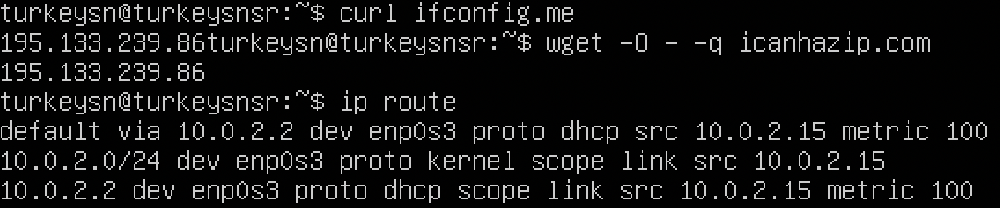
##### Задать статичные (заданные вручную, а не полученные от DHCP сервера) настройки ip, gw, dns (использовать публичный DNS серверы, например 1.1.1.1 или 8.8.8.8).  
``sudo nano /etc/netplan/00-installer-config.yaml`` 
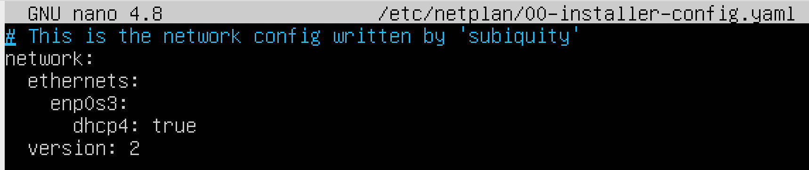
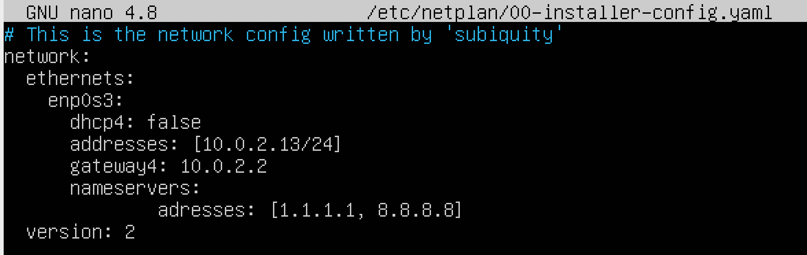 
``reboot`` 

``ping 1.1.1.1`` 
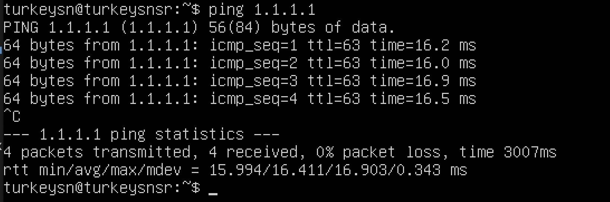 

``ping ya.ru`` 
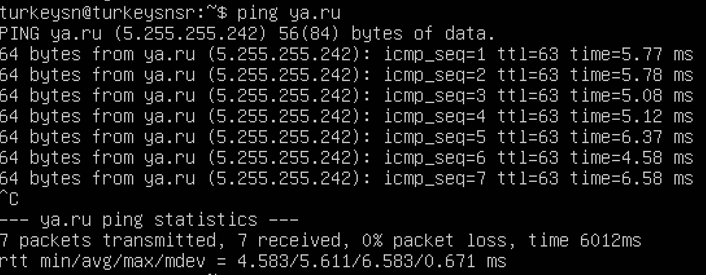

##### Перезагрузить виртуальную машину. Убедиться, что статичные сетевые настройки (ip, gw, dns) соответствуют заданным в предыдущем пункте.  
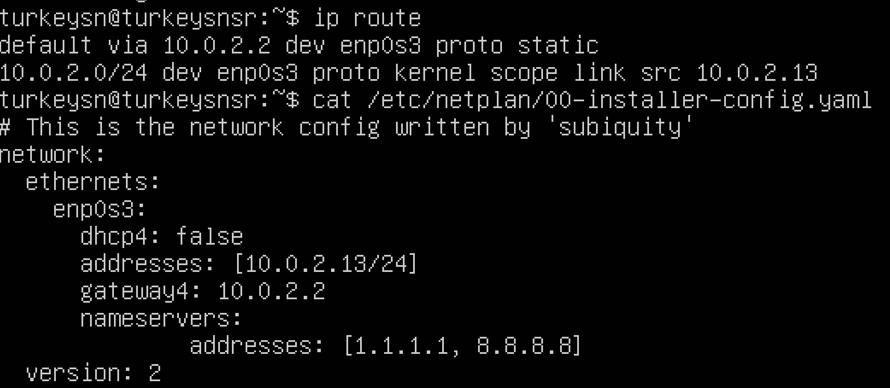

- В отчёте опишите, что сделали для выполнения всех семи пунктов (можно как текстом, так и скриншотами).
- Успешно пропинговать удаленные хосты 1.1.1.1 и ya.ru и вставить в отчёт скрин с выводом команды. В выводе команды должна быть фраза "0% packet loss".

## Part 4. Обновление ОС

**== Задание ==**

##### Обновить системные пакеты до последней на момент выполнения задания версии.  

- После обновления системных пакетов, если ввести команду обновления повторно, должно появиться сообщение, что обновления отсутствуют.
- Вставить скриншот с этим сообщением в отчёт.
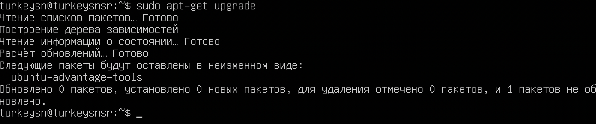

## Part 5. Использование команды **sudo**

**== Задание ==**

##### Разрешить пользователю, созданному в [Part 2](#part-2-создание-пользователя), выполнять команду sudo.

- В отчёте объяснить *истинное* назначение команды sudo (про то, что это слово - "волшебное", писать не стоит).  

``Sudo — это утилита, предоставляющая привилегии root для выполнения административных операций в соответствии со своими настройками. Она позволяет легко контролировать доступ к важным приложениям в системе. По умолчанию, при установке Ubuntu первому пользователю (тому, который создаётся во время установки) предоставляются полные права на использование sudo. Т.е. фактически первый пользователь обладает той же свободой действий, что и root.`` 

- Поменять hostname ОС от имени пользователя, созданного в пункте [Part 2](#part-2-создание-пользователя) (используя sudo).
- Вставить скрин с изменённым hostname в отчёт.

## Part 6. Установка и настройка службы времени

**== Задание ==**

##### Настроить службу автоматической синхронизации времени.  

- Вывести время часового пояса, в котором вы сейчас находитесь.
- Вывод следующей команды должен содержать `NTPSynchronized=yes`: \
  `timedatectl show`
- Вставить скрины с корректным временем и выводом команды в отчёт.
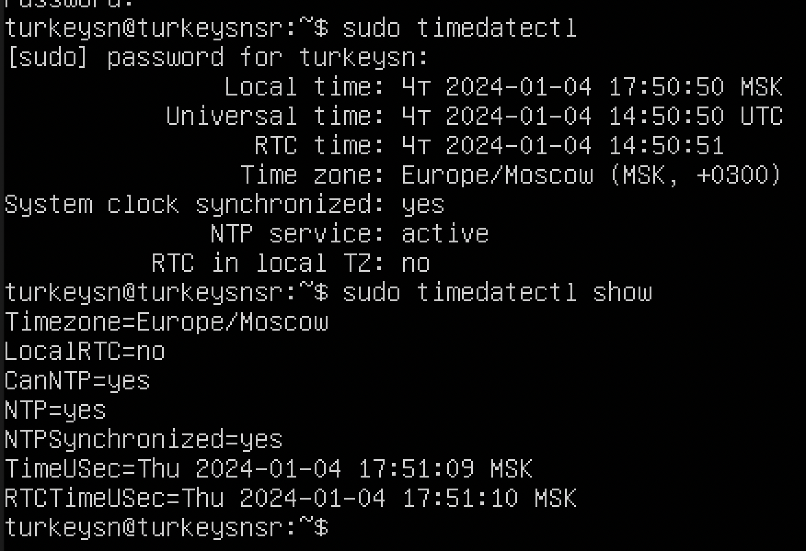

## Part 7. Установка и использование текстовых редакторов 

**== Задание ==**

##### Установить текстовые редакторы **VIM** (+ любые два по желанию **NANO**, **MCEDIT**, **JOE** и т.д.)  
##### Используя каждый из трех выбранных редакторов, создайте файл *test_X.txt*, где X -- название редактора, в котором создан файл. Напишите в нём свой никнейм, закройте файл с сохранением изменений.  
- В отчёт вставьте скриншоты:
  - Из каждого редактора с содержимым файла перед закрытием.
- В отчёте укажите, что сделали для выхода с сохранением изменений.

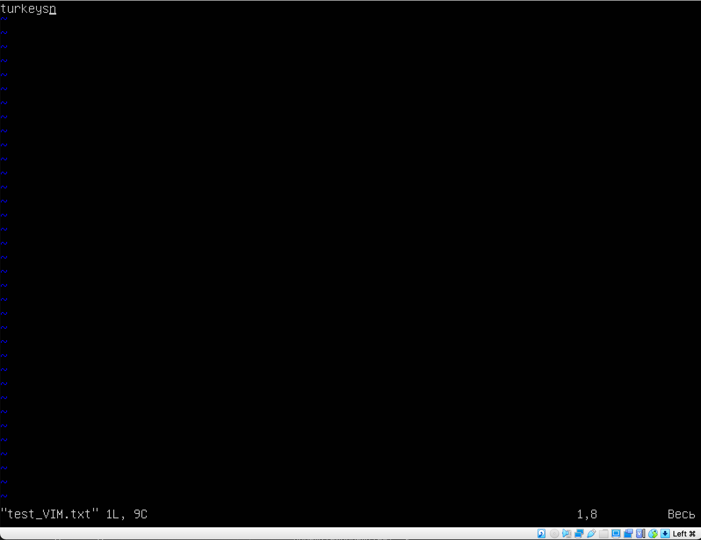
vim test_VIM.txt 
`` - Режим редактирования: I`` 
`` - Выйти из режима редактирования: esc`` 
`` - Выход с охранением: :wq`` 

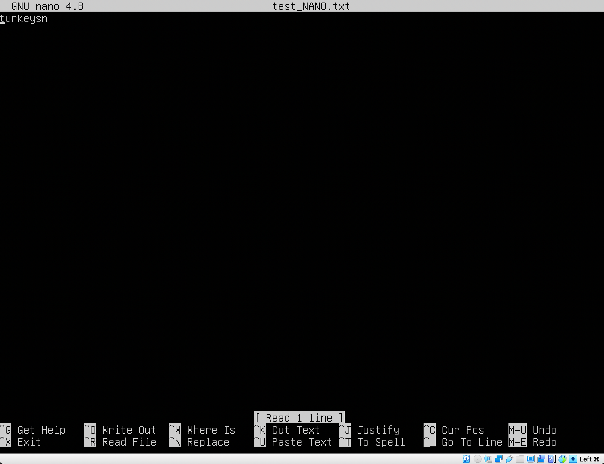 
`` - nano test_NANO.txt`` 
`` - Выход с охранением: CTRL + x, затем y b enter`` 

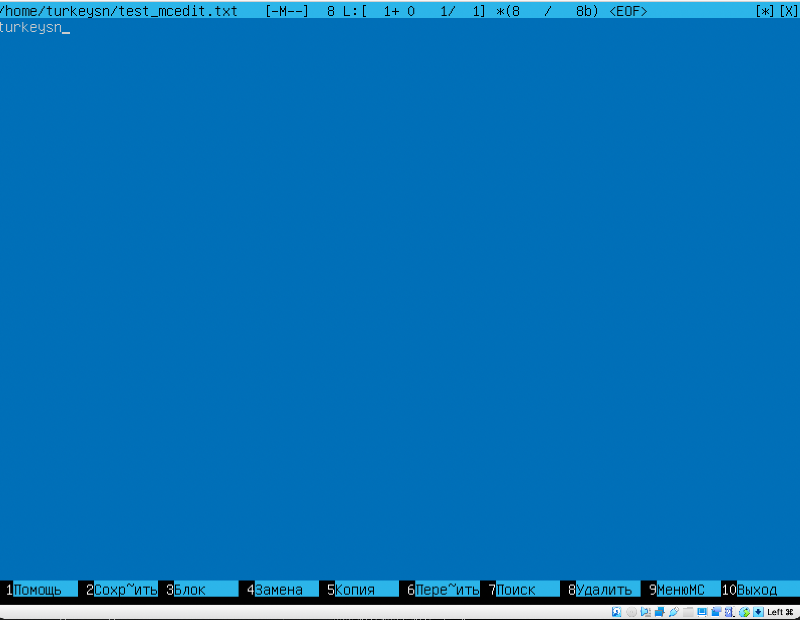 
`` - mcedit test_mcedit.txt`` 
`` - Выход с охранением: F2 (yes) + F10`` 

##### Используя каждый из трех выбранных редакторов, откройте файл на редактирование, отредактируйте файл, заменив никнейм на строку "21 School 21", закройте файл без сохранения изменений.
- В отчёт вставьте скриншоты:
    - Из каждого редактора с содержимым файла после редактирования.
- В отчёте укажите, что сделали для выхода без сохранения изменений.

 
`` - Выход без сохранения: :q / :q!`` 

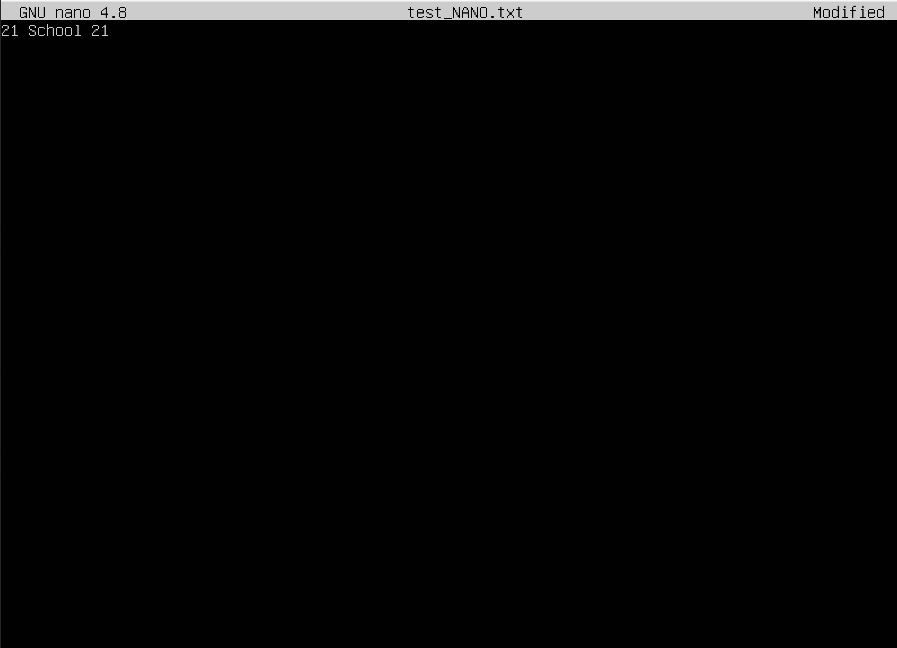
`` - Выход без сохранения: CTRL + x, затем n`` 

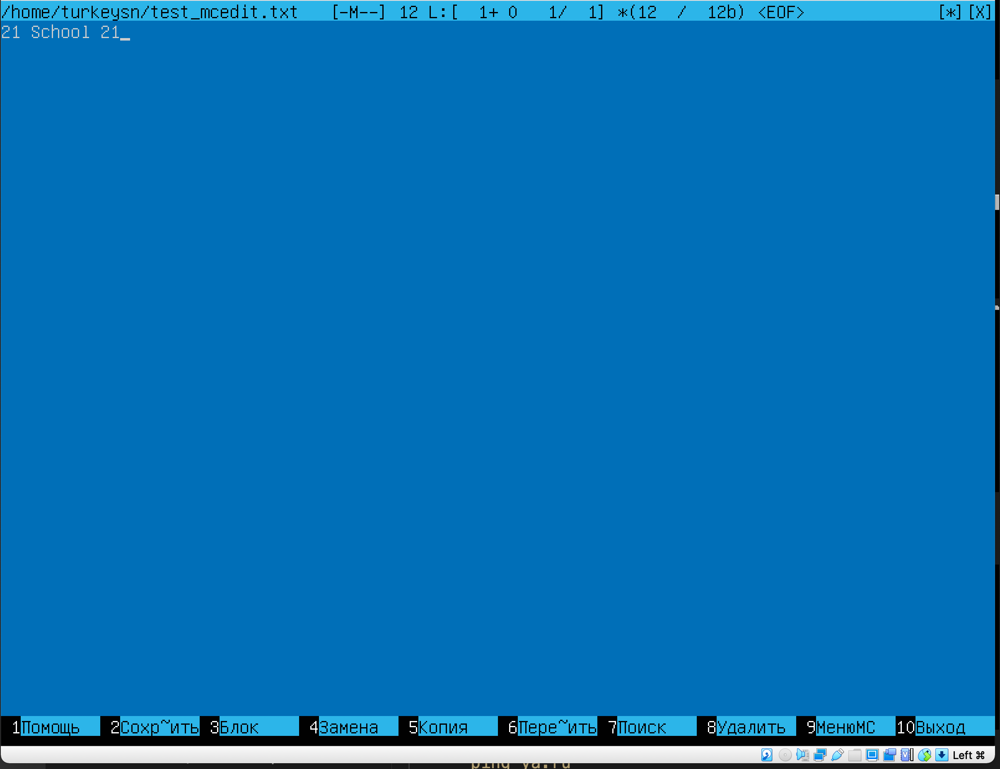
`` - Выход без сохранения: F10(no) / ESC(no)`` 

##### Используя каждый из трех выбранных редакторов, отредактируйте файл ещё раз (по аналогии с предыдущим пунктом), а затем освойте функции поиска по содержимому файла (слово) и замены слова на любое другое.
- В отчёт вставьте скриншоты:
    - Из каждого редактора с результатами поиска слова.
    - Из каждого редактора с командами, введёнными для замены слова на другое.

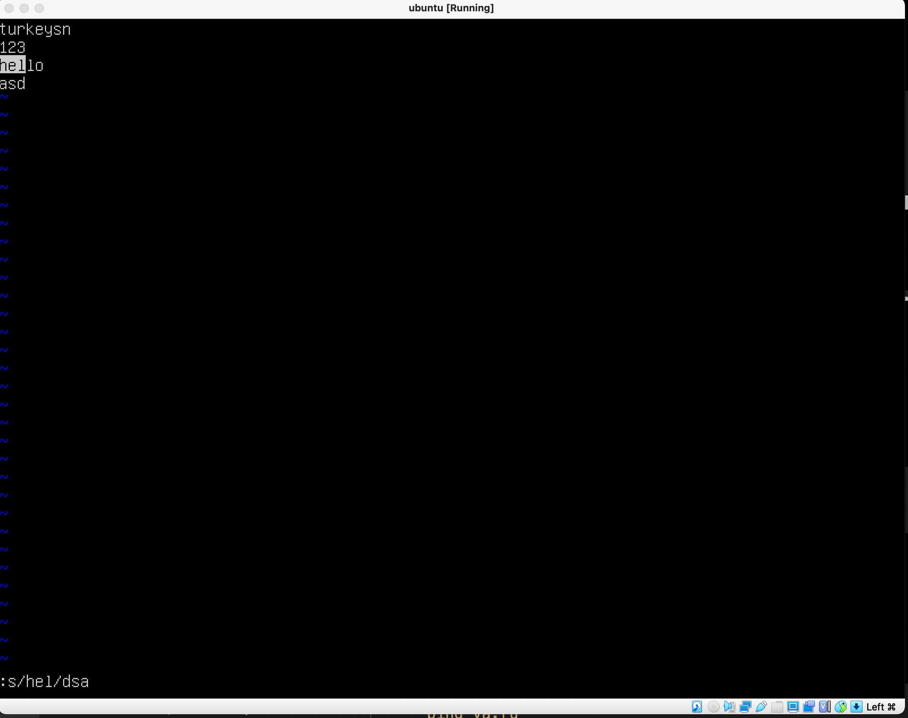 
`` - Поиск: /"текст, который хотим найти"`` 
`` - Замена: :s/"что хотим изменить"/"на что хотим заменить"`` 

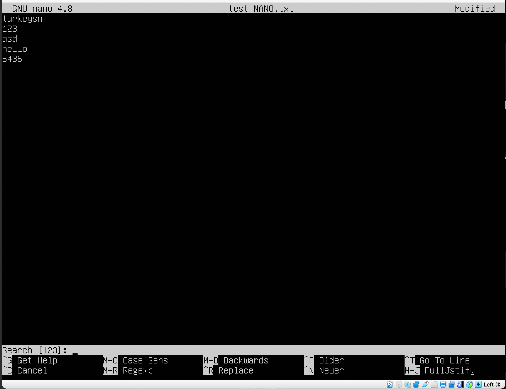
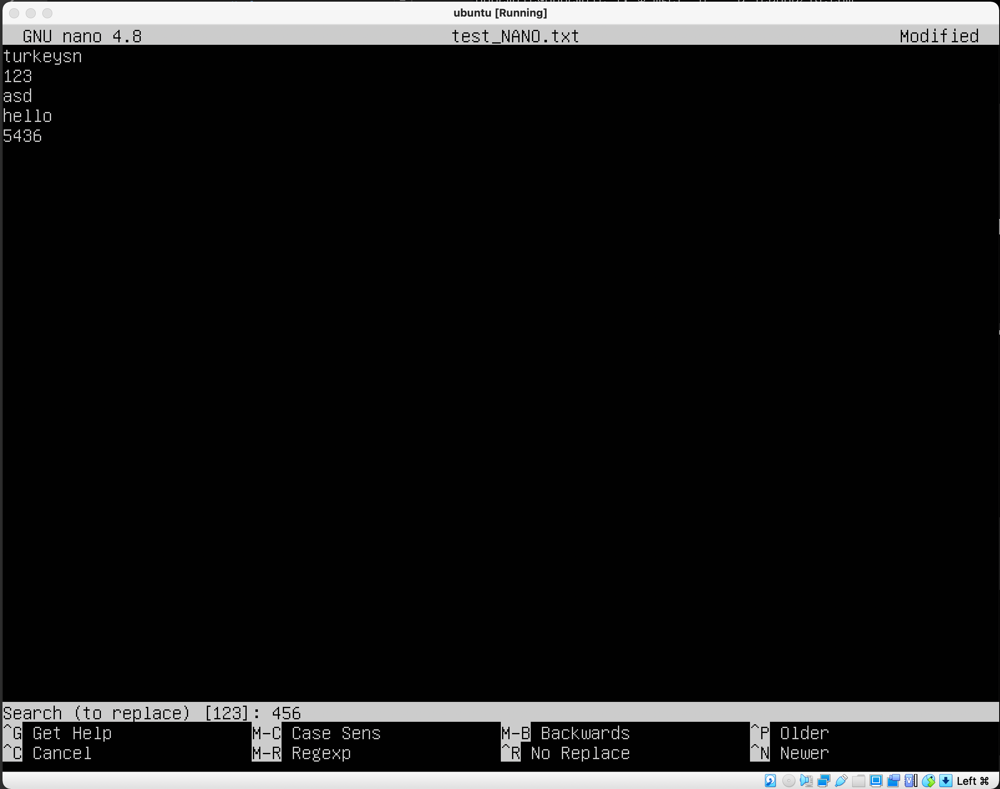
`` - Поиск: CTRL + W, затем enter (alt + w для перехода к след. вхождению, ctrl + c для преращения поиска)`` 
`` - Замена: CTRL + \ "что хотим изменить" enter "на что хотим заменить" enter. A(для замены все вхождения) или y и n по отдельности`` 

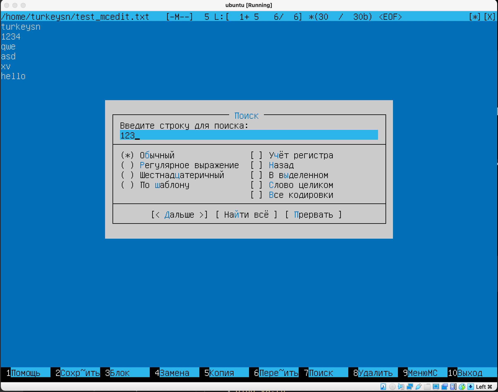
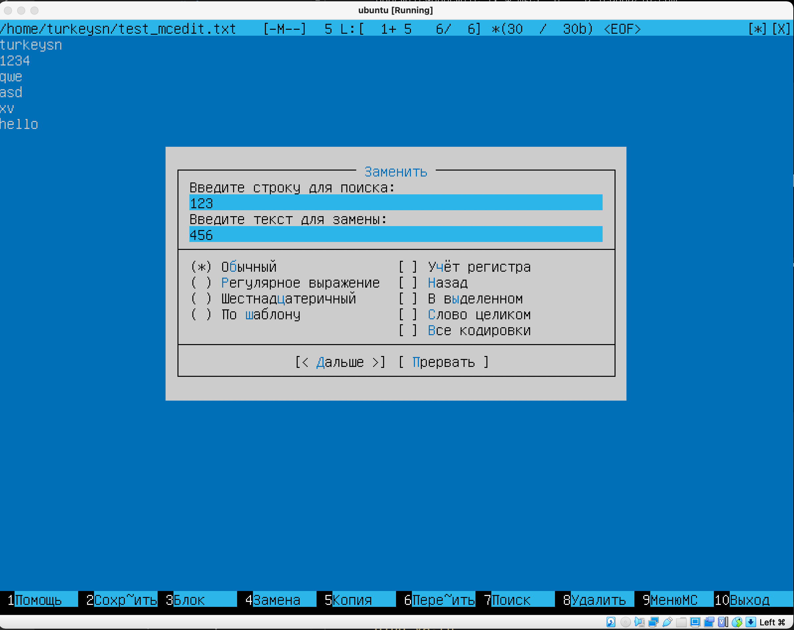
`` - Поиск: F7 + "текст который ищем" + "ок"`` 
`` - Замена: F4 + "что хотим изменить" + "на что хотим заменить" replace`` 

## Part 8. Установка и базовая настройка сервиса **SSHD**

**== Задание ==**

##### Установить службу SSHd.  

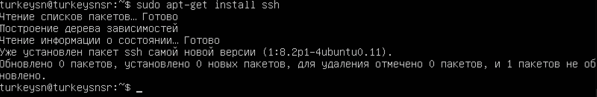 
`` - sudo apt-get install ssh`` 
`` - sudo apt install openssh-server`` 

##### Добавить автостарт службы при загрузке системы.  

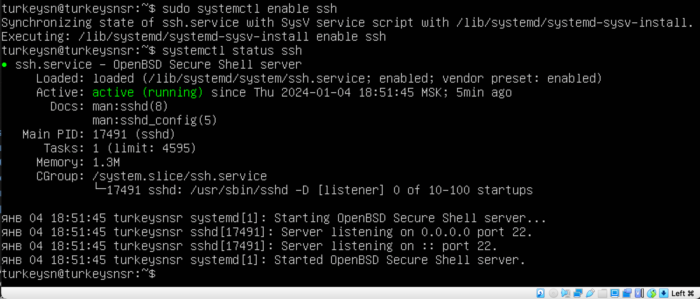 
`` - sudo systemctl enable sshd`` 
`` - systemctl status sshd`` 

##### Перенастроить службу SSHd на порт 2022.  

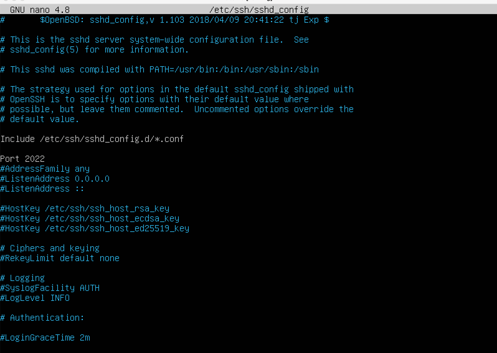 
`` - sudo nano /etc/ssh/sshd_config`` 
`` - systemctl restart sshd`` 

##### Используя команду ps, показать наличие процесса sshd. Для этого к команде нужно подобрать ключи.
- В отчёте объяснить значение команды и каждого ключа в ней.

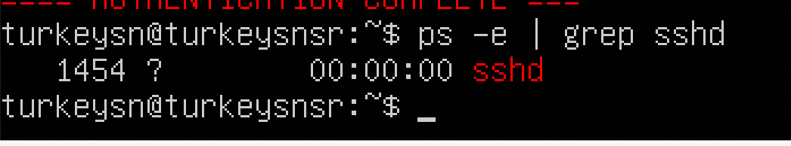 
`` - ps (показывает запущенные процессы, выполняемые пользователем в окне терминала);`` 
`` - ps -e или ps -A (Чтобы просмотреть все запущенные процессы);`` 
`` - ps -d (Чтобы показать все процессы, кроме лидеров сессии);`` 
`` - ps -d -N (можно инвертировать вывод с помощью переключателя -N. Например, если хочу вывести только лидеров сеансов)`` 
`` - ps T (увидеть только процессы, связанные с этим терминалом);`` 
`` - ps r (просмотреть все работающие (running) процессы);`` 
`` - ps -p 'pid' (если вы знаете идентификатор процесса PID, вы можете просто использовать следующую команду, для вывода процесса с этим 'pid');`` 
`` - ps -p 'pid1' 'pid2'`` 
`` - ps U 'userlist' (найти все процессы, выполняемые конкретным пользователем);`` 
`` - ps -ef (получить полный список);`` 
##### Перезагрузить систему.
- В отчёте опишите, что сделали для выполнения всех пяти пунктов (можно как текстом, так и скриншотами).
- Вывод команды netstat -tan должен содержать  \
`tcp 0 0 0.0.0.0:2022 0.0.0.0:* LISTEN`  \
(если команды netstat нет, то ее нужно установить)
- Скрин с выводом команды вставить в отчёт.
- В отчёте объяснить значение ключей -tan, значение каждого столбца вывода, значение 0.0.0.0.

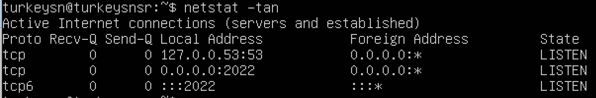 
`` - -t (--tcp) отображает соедниеня только по tcp`` 
`` - -a (--all) вывод всех активных подключений TCP`` 
`` - -n (--numeric) вывод активных подключений TCP с отображением адресов и номеров портов в числовом формате`` 
`` - Proto: Название протокола (протокол TCP или протокол UDP);`` 
`` - Recv-Q: очередь получения сети`` 
`` - Send-Q: Сетевая очередь отправки`` 
`` - Local Address адрес локального компьтера и используемы номер порта`` 
`` - Foreign Address адрес и номер удаленного компьтера к которомц подключен сокет`` 
`` - State состояние сокетв`` 
`` - 0.0.0.0 означает IP-адрес на локальной машине`` 
## Part 9. Установка и использование утилит **top**, **htop**

`-` Если бы меня спросили, что полезного делают утилиты **top** и **htop**, я бы ответил одним словом - всё.

**== Задание ==**

##### Установить и запустить утилиты top и htop.  
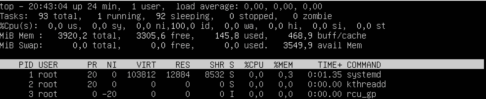 

- По выводу команды top определить и написать в отчёте:
  - uptime - ``24 min`` 
  - количество авторизованных пользователей - ``1 user`` 
  - общую загрузку системы - ``0.00 0.00 0.00`` 
  - общее количество процессов - ``93`` 
  - загрузку cpu - ``0.0%`` 
  - загрузку памяти - ``145.8`` 
  - pid процесса занимающего больше всего памяти - ``1238`` 
  ``top -o %MEM``
   
  - pid процесса, занимающего больше всего процессорного времени - ``1`` 
  ``top -o %CPU``
   

- В отчёт вставить скрин с выводом команды htop:
  - отсортированному по PID, PERCENT_CPU, PERCENT_MEM, TIME
  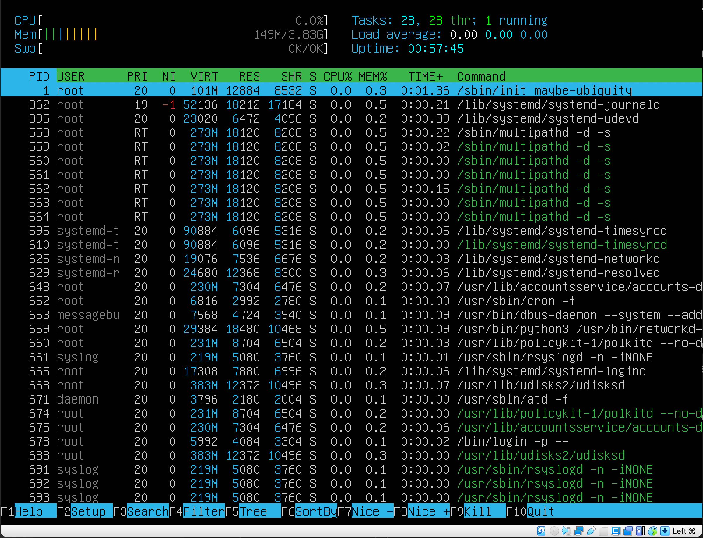 
  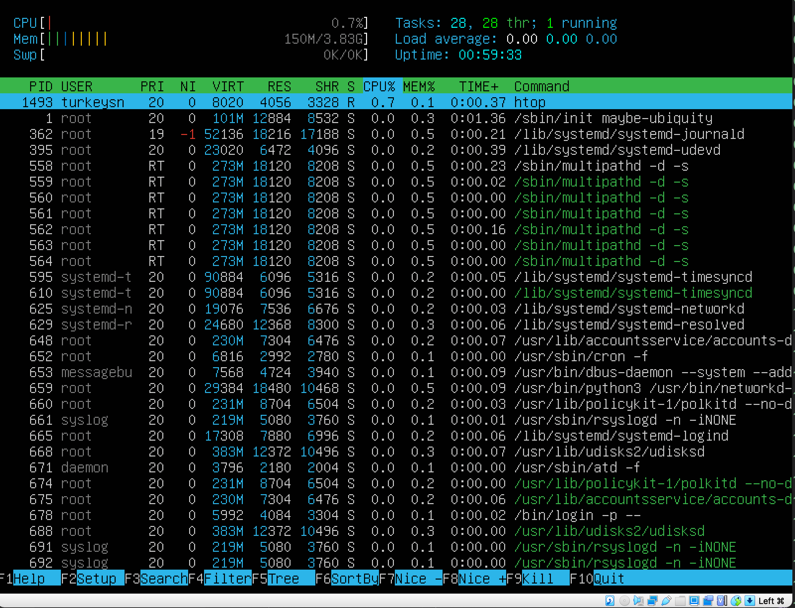 
  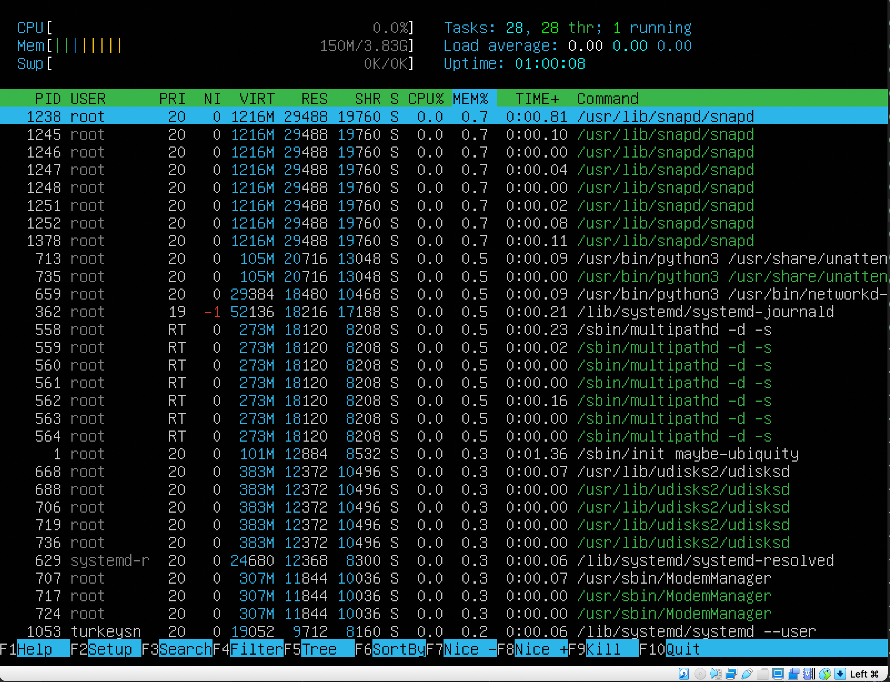 
  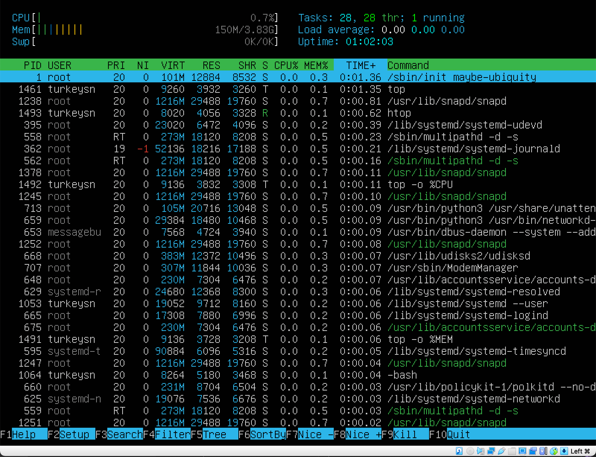 

  - отфильтрованному для процесса sshd
   

  - с процессом syslog, найденным, используя поиск 
  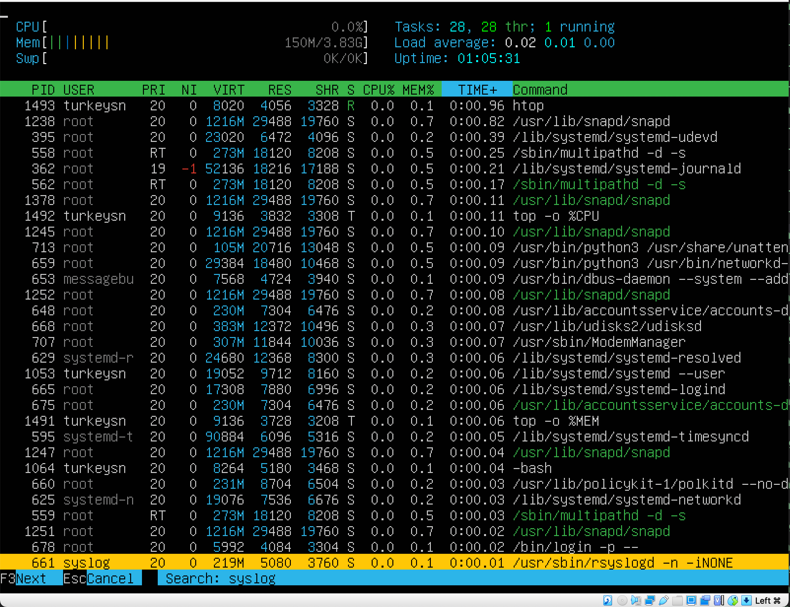 

  - с добавленным выводом hostname, clock и uptime  
  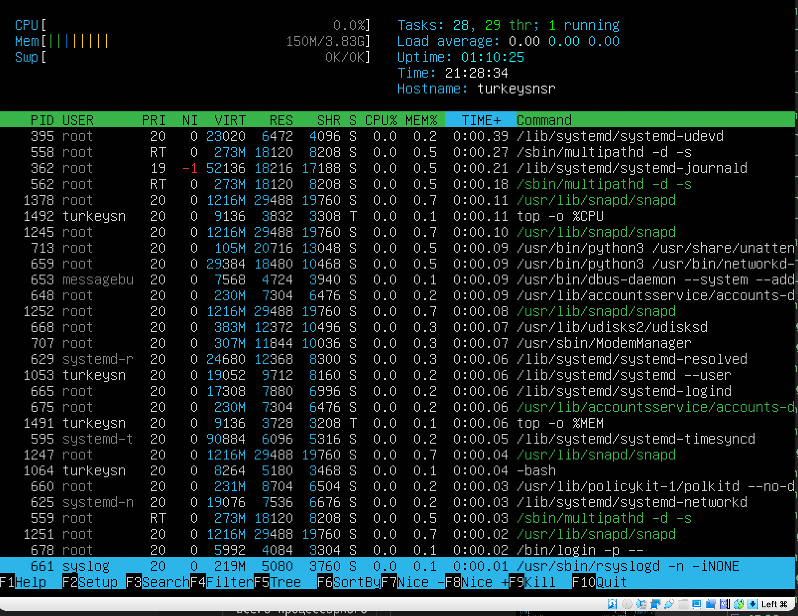 

## Part 10. Использование утилиты **fdisk**

**== Задание ==**

##### Запустить команду fdisk -l.

- В отчёте написать название жесткого диска, его размер и количество секторов, а также размер swap.

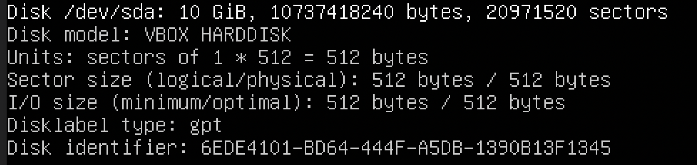
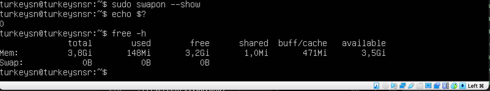 
`` - название жесткого диска - vbox harddisk;`` 
`` - размер - 10 GiB;`` 
`` - количество секторов - 20971520;`` 
`` - размер swap - 0 GiB.`` 

## Part 11. Использование утилиты **df** 

**== Задание ==**

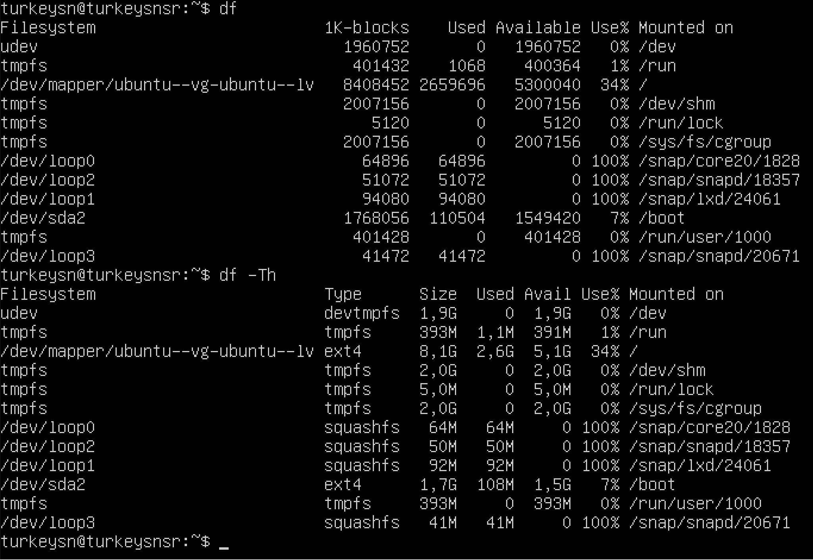

##### Запустить команду df.  
- В отчёте написать для корневого раздела (/): 
``  - размер раздела - 8408452`` 
``  - размер занятого пространства - 2659696`` 
``  - размер свободного пространства - 5300040`` 
``  - процент использования - 34%`` 
- Определить и написать в отчёт единицу измерения в выводе - ``килобайт``

##### Запустить команду df -Th.
- В отчёте написать для корневого раздела (/): 
``  - размер раздела - 8.1G`` 
``  - размер занятого пространства - 2.6G`` 
``  - размер свободного пространства - 5.1G`` 
``  - процент использования - 34%`` 
- Определить и написать в отчёт тип файловой системы для раздела - ``ext4`` 

## Part 12. Использование утилиты **du**

**== Задание ==**

##### Запустить команду du.
##### Вывести размер папок /home, /var, /var/log (в байтах, в человекочитаемом виде)
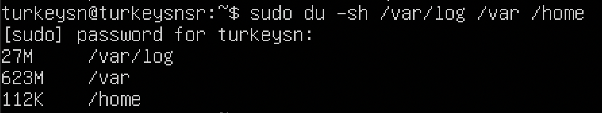
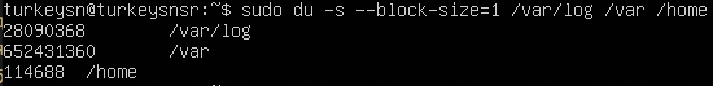

##### Вывести размер всего содержимого в /var/log (не общее, а каждого вложенного элемента, используя *)

- В отчёт вставить скрины с выводом всех использованных команд.

## Part 13. Установка и использование утилиты **ncdu**

**== Задание ==**

##### Установить утилиту ncdu.
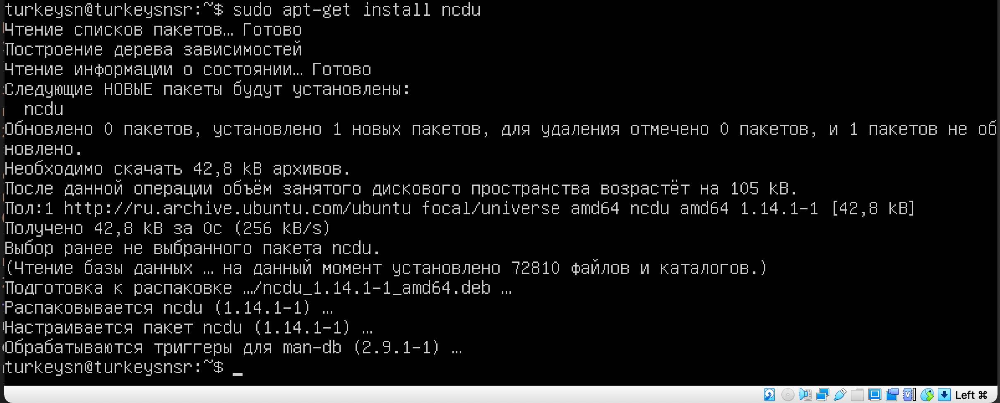
##### Вывести размер папок /home, /var, /var/log.
``ncdu /home`` 
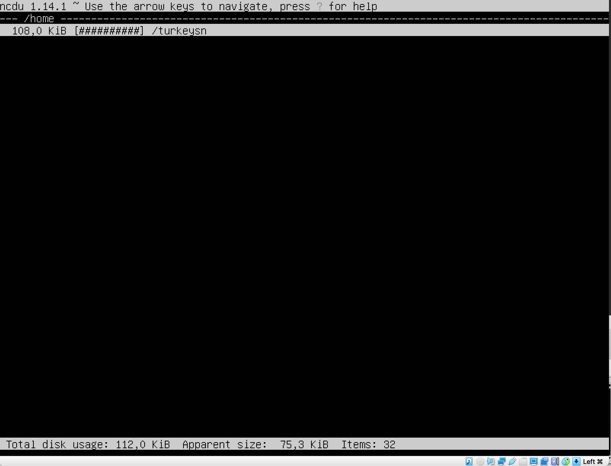
``ncdu /var`` 
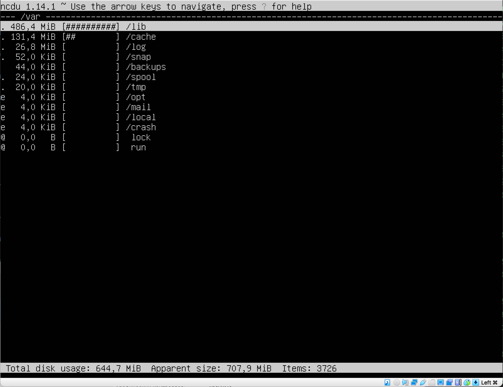
``ncdu /var/log`` 

- Размеры должны примерно совпадать с полученными в [Part 12](#part-12-использование-утилиты-du).

- В отчёт вставить скрины с выводом использованных команд.

## Part 14. Работа с системными журналами

**== Задание ==**

##### Открыть для просмотра:
##### 1. /var/log/dmesg 
``sudo nano /var/log/dmesg`` 
##### 2. /var/log/syslog
``sudo nano /var/log/syslog`` 
##### 3. /var/log/auth.log  
``sudo nano /var/log/auth.log`` 

- Написать в отчёте время последней успешной авторизации, имя пользователя и метод входа в систему.
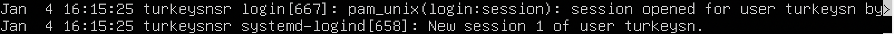
- Перезапустить службу SSHd.
- Вставить в отчёт скрин с сообщением о рестарте службы (искать в логах).
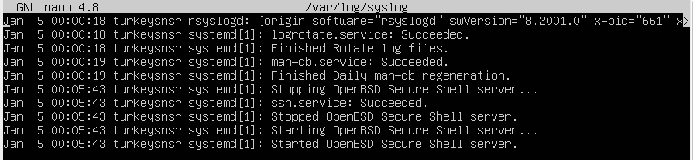

## Part 15. Использование планировщика заданий **CRON**

**== Задание ==**

##### Используя планировщик заданий, запустите команду uptime через каждые 2 минуты. 
``crontab -e Редактирование или создание файла расписания для текущего пользователя;`` 
``crontab -l Вывод содержимого расписания текущего пользователя;`` 
``crontab -r Удаление файла расписания текущего пользователя;`` 
``crontab -u user Работа с расписаниями конкретных пользователей.`` 

- 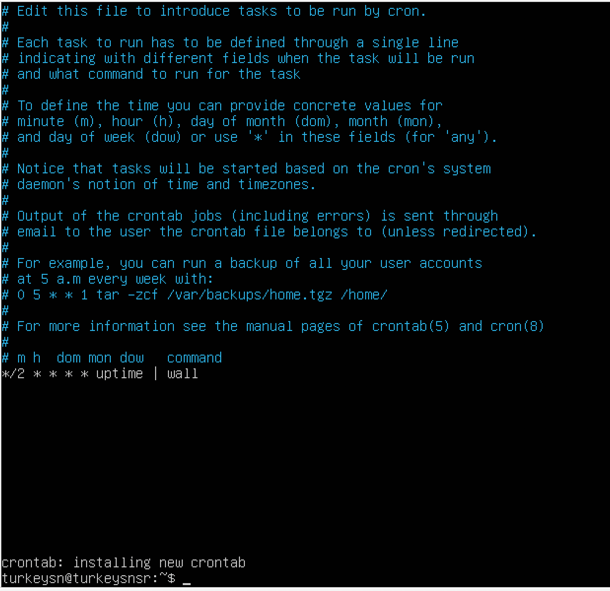 

- Найти в системных журналах строчки (минимум две в заданном временном диапазоне) о выполнении.

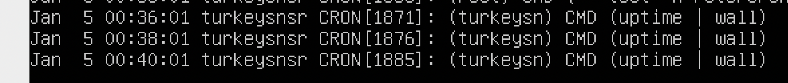

- Вывести на экран список текущих заданий для CRON.
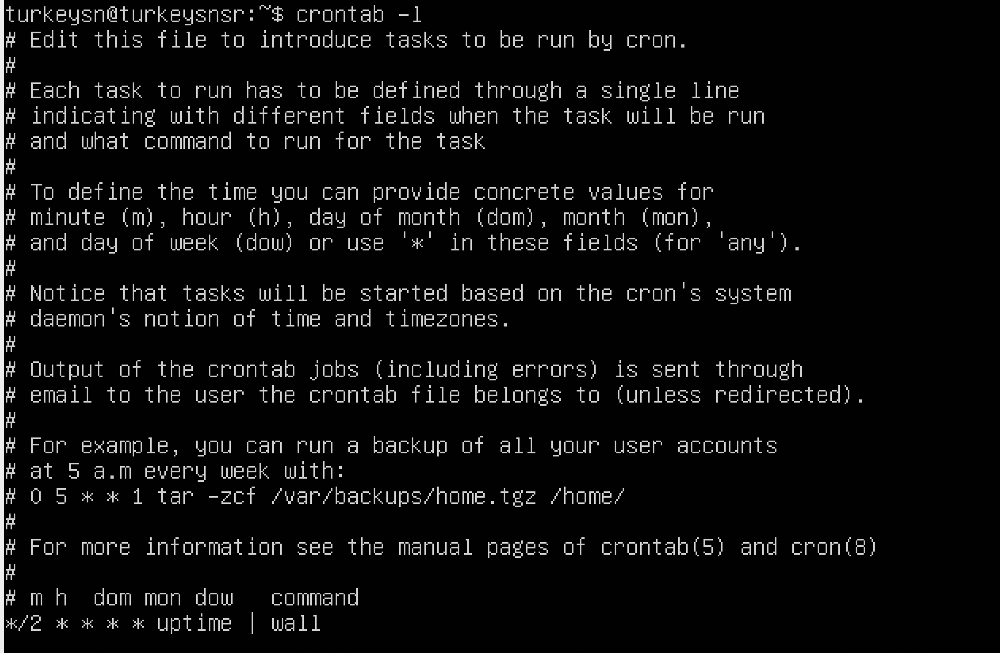

- Вставить в отчёт скрины со строчками о выполнении и списком текущих задач.

##### Удалите все задания из планировщика заданий.
- В отчёт вставьте скрин со списком текущих заданий для CRON.
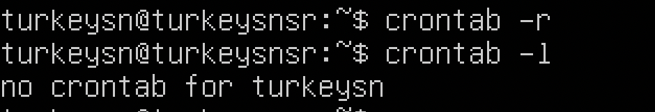

💡 [Нажми тут](https://forms.yandex.ru/cloud/641817c002848f26a078c4a6/), **чтобы поделиться с нами обратной связью на этот проек**т. Это анонимно и поможет команде Продукта сделать твоё обучение лучше.
